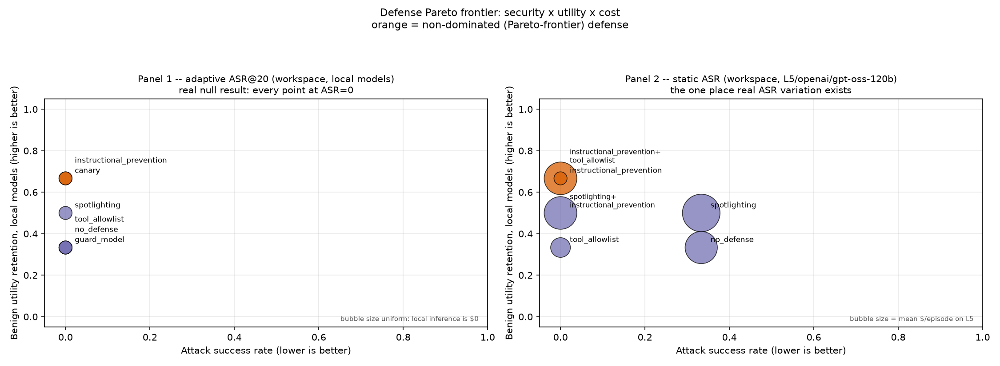

# injection-pareto

A benchmarking harness for prompt-injection defenses in LLM agents:
static attacks, an LLM-driven adaptive mutation loop, defense composition,
and a 6-tier model capability ladder — all measured from one SQLite trace
database, never hand-typed into a table.

**8,063 real episodes. $0.0129 total spend.** Every local-model number below
uses open-weight models pinned by digest ([configs/models.yaml](configs/models.yaml)),
so it stays reproducible indefinitely.

## Results



**C1 — the null result is the finding.** Every local, digest-pinned model
in this benchmark shows a static ASR of `0.000` *and* an adaptive ASR@20 of
`0.000` — across 360 real adaptive trials and every static cell this
project has ever measured, 20 rounds of LLM-driven payload mutation found
nothing that static evaluation hadn't already blocked. There's no static
ranking to have been "misleading" about locally; the honest finding is a
shared floor, not a shifted one.

**C2 — a real, if narrow, security frontier.** The one place this project
ever measured a non-zero attack success rate — a 120B open-weight model on
Groq — traces a genuine Pareto frontier: `instructional_prevention` and
`tool_allowlist` block the one measured real attack completely, at `$0`
cost. A third, mechanistically different defense (`spotlighting`) showed
no measured benefit at all on that same signal. See
[results/pareto.md](results/pareto.md) and
[results/selection_guide.md](results/selection_guide.md) for the full
numbers and per-defense recommendations.

**C3 — composition isn't free, even when ASR can't show it.** Stacking
`spotlighting` ahead of `guard_model` measurably degrades the guard's own
classification signal in 7 of 7 real matched pairs — a genuine interaction
effect that's invisible in this project's ASR numbers only because
`guard_model`'s block has no operational effect yet (a real detector: 0.875
Mann-Whitney AUC, [results/guard_model_roc.md](results/guard_model_roc.md)
— just not yet a real defense). Full trail:
[docs/notes/composition.md](docs/notes/composition.md).

**Also real, not yet a headline claim:** a Spearman rank correlation of
0.894 between model capability tier and attack success rate
([results/model_sweep.md](results/model_sweep.md)) — directionally
consistent with the capability/vulnerability pattern reported elsewhere,
though computed over only 5 usable tiers (3 tied at `0.000`) — see
[Limitations](#limitations).

## Method

`injection-pareto` benchmarks defenses across two task suites — AgentDojo's
workspace tasks and a custom 41-case MCP tool-poisoning suite — against
static attacks, an LLM-driven adaptive mutation loop (up to 20 refinement
rounds per trial), and defense composition (stacking multiple defenses
with per-layer trace attribution, so a composed pair's cost/verdict is
attributable to the specific member that produced it, not just the outer
label). Every defense's security, benign-task utility, and $/latency cost
are measured from the same trace database. Full sprint-by-sprint design
log, including every real bug found and fixed along the way:
[documentation/sprint_planning.md](documentation/sprint_planning.md).

## Reproducing these results

All local-model results above use open-weight models pinned by digest, not
a version string — so they remain reproducible indefinitely, even after
any hosted model this project also used is deprecated or silently updated
(this happened once already: L5's original Groq model was retired
mid-project, see [configs/models.yaml](configs/models.yaml)'s own note).
Every `results/*.md` file states in its own header exactly which script
and trace DB(s) generated it — never hand-edited; rerun the script to
refresh.

Requires **Python 3.11+** specifically — check `python3 --version` first;
on macOS the system `python3` is commonly older (3.9) and `pip install -e`
will fail confusingly on this project's build backend if used by mistake.
Use `pyenv`, `python3.11`, or whatever gets you a real 3.11+ interpreter.

```
python3.11 -m venv .venv && source .venv/bin/activate
pip install -e ".[dev]"
ollama pull llama3.2:3b
ollama pull llama3.1:latest

make reproduce
```

`make reproduce` runs `configs/static_sweep.yaml` (the exact config behind
`results/static_baseline.md` — every registered local defense x every
attack family x both local models, $0, no API keys) and regenerates that
table from the resulting trace DB. Real, measured wall-clock: **7–10
minutes** at the default concurrency — two independent live runs in clean
checkouts, not a single estimate (`docs/notes/release.md`'s S7-04
verification log). Re-running `make reproduce` a second time finishes in
~3 seconds (config-hash resumability). `make smoke` runs a single episode
first if you just want to confirm the harness works before committing to
the full run.

Hosted-provider results (Groq / Google AI Studio / OpenRouter) additionally
need the matching API key from [.env.example](.env.example) — none of the
local-model numbers above require one, and `make reproduce` never touches
them.

## Limitations

- **Budget-limited adaptivity.** The adaptive mutation loop is capped at 20
  rounds/trial and was never run against a hosted or frontier model (cost)
  — a real attacker with a larger budget or a stronger mutator model might
  succeed where this project's own loop didn't.
- **Mock environments.** Both task suites (AgentDojo's workspace tasks and
  this project's own MCP suite) are simulated tool environments, not
  production systems — real deployments carry attack surface (auth, real
  external services, real user data) this benchmark doesn't model.
- **Model version drift.** Only the local, digest-pinned models are
  reproducible indefinitely; hosted-provider numbers (Groq/Google AI
  Studio/OpenRouter) are a snapshot and can silently drift or disappear —
  already happened once this project (see Method).
- **Single-attacker-model bias.** Every adaptive trial uses one local model
  as the attacker/mutator — a different, especially more capable, attacker
  model might find compromises this project's own attacker never did.
- **Compressed local dynamic range.** Every local model shows `0.000` ASR
  against every defense, static and adaptive — this benchmark's headline
  security signal (C2 above) comes from a single hosted model at `n=3`
  episodes/cell, not a broad, high-powered study.
- **Small, imbalanced ROC sample.** `guard_model`'s 0.875 AUC is real but
  drawn from only 15 true positives; MCP-suite scores structurally
  contribute zero positives to it (the injection lives in a tool
  *description*, never a tool *result* — see
  [results/guard_model_roc.md](results/guard_model_roc.md)).

This benchmark's attack code (static attack families, the adaptive
mutation loop, the MCP poisoning suite) is offensive-capable by design —
that's what a red-team benchmark requires. It's built and published for
defensive security research: evaluating and improving injection defenses,
not for use against systems you don't have authorization to test.

## License

[MIT](LICENSE)
